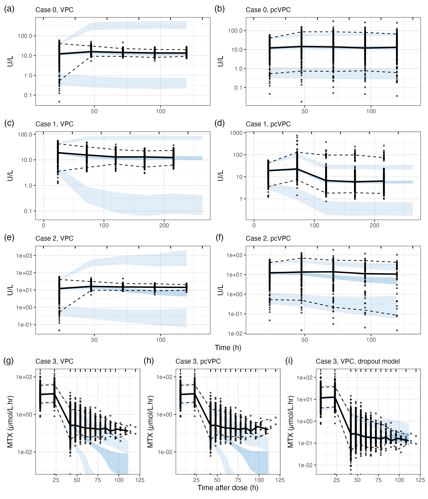

<!-- README.md is generated from README.Rmd. Please edit that file -->

```{r, include = FALSE}
knitr::opts_chunk$set(
  collapse = TRUE,
  comment = "#>"
)
```

# The VPC and Real World Data

The visual predictive check (VPC) is a standard tool for assessing 
pharmacometric model suitability, producing visualizations that compare observed
data with simulated data such that both model structure and model variability 
terms can be assessed. However, real-world data commonly reflect clinical 
decision-making that adapts therapy in response to patient data. As a result, 
VPCs constructed from such data may display apparent model misspecification, 
even when models are well-specified. To illustrate possible confounders, four 
common real-world therapy adaptation scenarios were simulated: (1) varying dose 
amount with constant interval, (2) varying dosing interval with constant dose 
amount, (3) patient dropout after identification of a suitable maintenance dose, 
and (4) variability in sample timing and frequency based on drug concentration
measurements. For all scenarios, simulated observations were generated using the 
same model used to produce the VPC simulations, ensuring that the model was 
unbiased. When only the dose amount varied, the prediction-corrected VPC 
(pcVPC) appropriately indicated a well-specified model. In all other cases, both 
VPC and pcVPC erroneously suggested a misspecified model. These simulated 
results, together with our broader experience with complex real-world data, 
demonstrate that VPCs can be misleading when applied to real-world data. We 
therefore recommend against relying on VPCs to assess model suitability in 
real-world settings if dosing interval, sample timing or sample frequency varies 
in response to measured drug concentrations.

```{r plot}

```

This figure shows a comparison of visual predictive check (VPC) and 
prediction-corrected VPC (pcVPC) for each considered case. Case 0: adaptive 
dosing with dose quantity adjustment, (a) VPC and (b) pcVPC. Case 1: adaptive 
dosing with dose interval adjustment, (c) VPC and (d) pcVPC. Case 2: adaptive 
dosing with dropout based identification of a suitable maintenance dose, (e) VPC 
and (f) pcVPC. Case 3: Sampling strategy varying based on measured values, (g) 
VPC, (h) pcVPC, (i) VPC with censoring model applied to simulated data. Points 
indicate individual observations. Solid black lines (dashed black lines) 
indicate the median (5th and 95th percentile) of the observed data. Dark blue 
(light blue) shaded regions indicate the 95% confidence interval for the 
predicted median (5th and 95th percentile) based on simulation. MTX: 
methotrexate.
